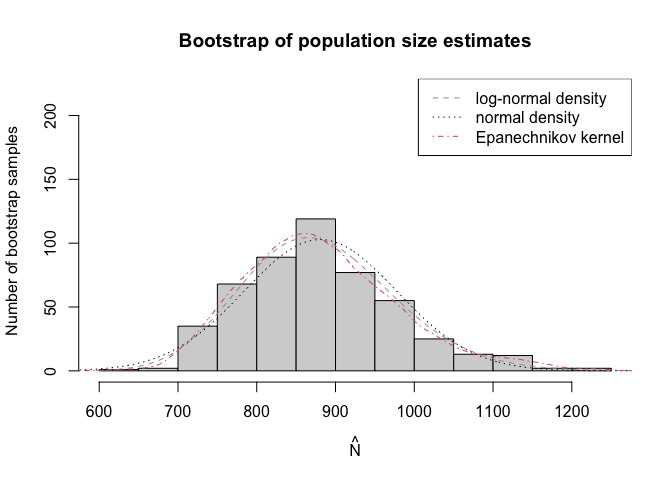

<!-- README.md is generated from README.Rmd. Please edit that file -->

# singleRcaptureExtra

<!-- badges: start -->
<!-- badges: end -->

An expention of `singleRcapture` package to handle fitted object from
other R packages with zero truncated regression capabilities (and in the
future the same for ratio regression models)

### Quick demo

Utilising additive models when effect is non linear:

``` r
library(VGAM)
#> Warning: package 'VGAM' was built under R version 4.3.1
#> Loading required package: stats4
#> Loading required package: splines
library(singleRcaptureExtra)
#> Loading required package: singleRcapture
set.seed(123)
x <- rnorm(n = 1000)
y <- rpois(n = 1000, lambda = exp(-1 + cos(x)))
data <- data.frame(y = y, x = x)
data <- data[data$y > 0, ]

additiveModel <- vgam(y ~ s(x, df = 3), data = data, family = pospoisson())

summary(estimatePopsize(additiveModel))
#> 
#> Call:
#> estimatePopsize.vgam(formula = additiveModel)
#> 
#> -----------------------
#> Population size estimation results: 
#> Point estimate 998.9831
#> Observed proportion: 50.8% (N obs = 507)
#> Std. Error 55.37032
#> 95% CI for the population size:
#>           lowerBound upperBound
#> normal      890.4593   1107.507
#> logNormal   901.8689   1119.982
#> 95% CI for the share of observed population:
#>           lowerBound upperBound
#> normal      45.77849   56.93691
#> logNormal   45.26860   56.21660
```

We see that `1000` is well with confidence intervals and that estimates
for `x` are approximately correct:

``` r
plotvgam(additiveModel, data)
```

 with the
actual curve being:


We also allow bootstrap methods:

``` r
x <- rnorm(n = 1000)
y <- rpois(n = 1000, lambda = exp(-1 + x))
m1 <- vglm(y ~ x, data = data, family = pospoisson())
singleRm1 <- estimatePopsize(m1, popVar = "bootstrap")
summary(singleRm1)
#> 
#> Call:
#> estimatePopsize.vglm(formula = m1, popVar = "bootstrap")
#> 
#> -----------------------
#> Population size estimation results: 
#> Point estimate 933.535
#> Observed proportion: 54.3% (N obs = 507)
#> Boostrap sample skewness: 0.1734202
#> 0 skewness is expected for normally distributed variable
#> ---
#> Bootstrap Std. Error 48.13169
#> 95% CI for the population size:
#> lowerBound upperBound 
#>   845.2718  1029.8236 
#> 95% CI for the share of observed population:
#> lowerBound upperBound 
#>   49.23173   59.98071
```

The `plots` method that is available for native `singleRcapture` object
are also (being) developed for `singleRcaptureExtra` objects
(`singleRforeign` class)

``` r
plot(singleRm1, plotType = "bootHist", ylim = c(0, 220))
```



Diagnostics from `singleRcapture` are also available:

``` r
summary(marginalFreqVglm(singleRm1))
#> Test for Goodness of fit of a regression model:
#> 
#>                  Test statistics df P(>X^2)
#> Chi-squared test         3257.39  2       0
#> G-test                   1635.35  2       0
#> 
#> -------------------------------------------------------------- 
#> Cells with fitted frequencies of < 5 have been dropped 
#> Names of cells used in calculating test(s) statistic: 1 2 3 4 5
```

Utilising popular `countreg` package (compare with `singleRcapture`):

``` r
library(countreg)
#> Loading required package: MASS
#> Loading required package: Formula
#> 
#> Attaching package: 'countreg'
#> The following object is masked from 'package:singleRcapture':
#> 
#>     ztpoisson
#> The following objects are masked from 'package:VGAM':
#> 
#>     dzipois, pzipois, qzipois, rzipois
model <- zerotrunc(
  formula = capture ~ gender + age + nation, 
  data = netherlandsimmigrant, 
  dist = "poisson"
)
print(summary(estimatePopsize(model)), 
      # Print summary of foreign object (works for all methods)
      summaryForeign = TRUE)
#> 
#> Call:
#> estimatePopsize.zerotrunc(formula = model)
#> 
#> -----------------------
#> Population size estimation results: 
#> Point estimate 12690.36
#> Observed proportion: 14.8% (N obs = 1880)
#> Std. Error 2808.169
#> 95% CI for the population size:
#>           lowerBound upperBound
#> normal      7186.451   18194.27
#> logNormal   8431.281   19718.33
#> 95% CI for the share of observed population:
#>           lowerBound upperBound
#> normal     10.332923   26.16034
#> logNormal   9.534278   22.29792
#> 
#> -------------------------------
#> -- Summary of foreign object --
#> -------------------------------
#> 
#> Call:
#> zerotrunc(formula = capture ~ gender + age + nation, data = netherlandsimmigrant, 
#>     dist = "poisson")
#> 
#> Deviance residuals:
#>     Min      1Q  Median      3Q     Max 
#> -0.6992 -0.6992 -0.4244 -0.2971  4.2213 
#> 
#> Coefficients (truncated poisson with log link):
#>                      Estimate Std. Error z value Pr(>|z|)    
#> (Intercept)           -1.3411     0.2149  -6.241 4.35e-10 ***
#> gendermale             0.3972     0.1630   2.436 0.014832 *  
#> age>40yrs             -0.9746     0.4082  -2.387 0.016971 *  
#> nationAsia            -1.0926     0.3016  -3.622 0.000292 ***
#> nationNorth Africa     0.1900     0.1940   0.979 0.327399    
#> nationRest of Africa  -0.9106     0.3008  -3.027 0.002468 ** 
#> nationSurinam         -2.3364     1.0136  -2.305 0.021159 *  
#> nationTurkey          -1.6754     0.6028  -2.779 0.005445 ** 
#> ---
#> Signif. codes:  0 '***' 0.001 '**' 0.01 '*' 0.05 '.' 0.1 ' ' 1
#> 
#> Number of iterations in BFGS optimization: 30 
#> Log-likelihood: -848.5 on 8 Df

model <- estimatePopsize(
  formula = capture ~ gender + age + nation, 
  data = netherlandsimmigrant, 
  model = singleRcapture::ztpoisson
)
summary(model)
#> 
#> Call:
#> estimatePopsize.default(formula = capture ~ gender + age + nation, 
#>     data = netherlandsimmigrant, model = singleRcapture::ztpoisson)
#> 
#> Pearson Residuals:
#>      Min.   1st Qu.    Median      Mean   3rd Qu.      Max. 
#> -0.486442 -0.486442 -0.298080  0.002093 -0.209444 13.910844 
#> 
#> Coefficients:
#> -----------------------
#> For linear predictors associated with: lambda 
#>                      Estimate Std. Error z value  P(>|z|)    
#> (Intercept)           -1.3411     0.2149  -6.241 4.35e-10 ***
#> gendermale             0.3972     0.1630   2.436 0.014832 *  
#> age>40yrs             -0.9746     0.4082  -2.387 0.016972 *  
#> nationAsia            -1.0926     0.3016  -3.622 0.000292 ***
#> nationNorth Africa     0.1900     0.1940   0.979 0.327398    
#> nationRest of Africa  -0.9106     0.3008  -3.027 0.002468 ** 
#> nationSurinam         -2.3364     1.0136  -2.305 0.021159 *  
#> nationTurkey          -1.6754     0.6028  -2.779 0.005445 ** 
#> ---
#> Signif. codes:  0 '***' 0.001 '**' 0.01 '*' 0.05 '.' 0.1 ' ' 1
#> 
#> AIC: 1712.901
#> BIC: 1757.213
#> Residual deviance: 1128.553
#> 
#> Log-likelihood: -848.4504 on 1872 Degrees of freedom 
#> Number of iterations: 8
#> -----------------------
#> Population size estimation results: 
#> Point estimate 12690.35
#> Observed proportion: 14.8% (N obs = 1880)
#> Std. Error 2808.169
#> 95% CI for the population size:
#>           lowerBound upperBound
#> normal      7186.444   18194.26
#> logNormal   8431.275   19718.32
#> 95% CI for the share of observed population:
#>           lowerBound upperBound
#> normal     10.332927   26.16037
#> logNormal   9.534281   22.29793
```

## Funding

Work on this package is supported by the the National Science Center,
OPUS 22 grant no. 2020/39/B/HS4/00941.
